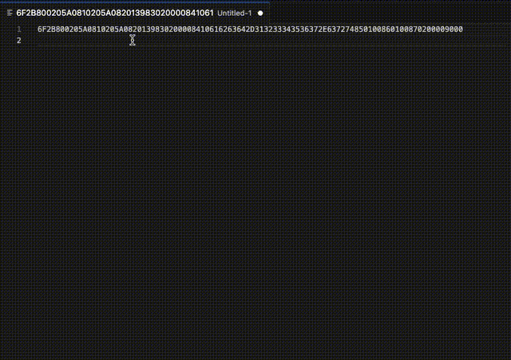

# emv-tools

`emv-tools` is a necessary tool when developing a payment terminal.

## Parsing `R-APDU`

Analyze the `R-APDU` which is the response of the card reader.



### Usage

1. Select the `R-APDU` you want to analyze on the editor.
1. Selection includes Status Word (SW1, SW2).
1. Select `Analyze R-APDU` from the context menu.
1. Analysis results are displayed in a new tab.


### Tag name

The following tags display names.
* Tags as described in `EMV 4.4 Book 3 - A2 Data Elements`.
* Tags as described in `ISO 7816-4, 5.1.5 File control information`.

Terminal-specific tags are displayed as `unknown template` or `unknown value`.

## Private TLV

* You can support card reader specific tags by placing `.emv-tags.json` in your workspace directory.
* `.emv-tags.json` is specified by an array of `tag_info` structures.

### `tag_info`

| property | required | type | description |
| - | - | - | - |
| tag | o | string | A hexadecimal string representing the tag (uppercase) |
| name | o | string | Tag name |
| template | o | string[] | Tags that can be parents of this tag |
| length |  | number | Specify when the meaning changes depending on the length of the value |

### sample `.emv-tags.json`

```json
[
  {"tag": "E1", "name": "Card Data", "template": []},
  {"tag": "DFAE05", "name": "KSN", "template": ["E1"]},
  {"tag": "E3", "name": "Track Info", "template": ["E1"]},
  {"tag": "DFDF41", "name": "Track 1 Data", "template": ["E3"]},
  {"tag": "DFDF42", "name": "Track 2 Data", "template": ["E3"]}
]
```
